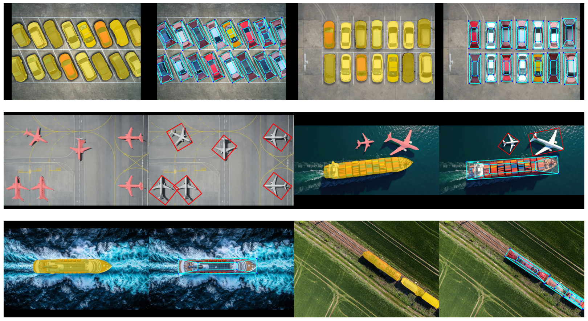
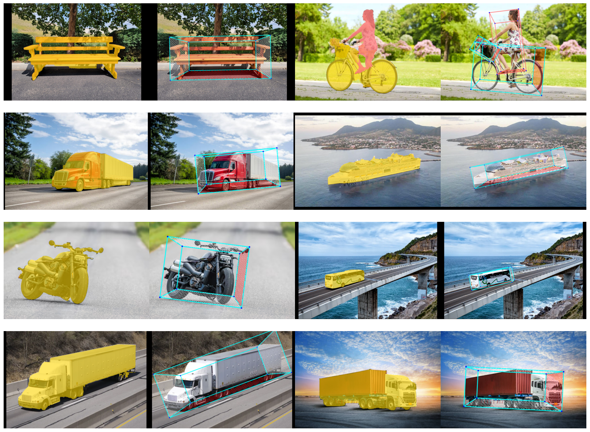

    <h1>3D Object Detection with OBB using DETR SAM and   DepthAnythingV2 in Hugging Face</h1>

## 🧊 Monocular 3D Object Detection

## 🔶 OBB from SAM mask

## 🔳 2D Rotated Bounding Box with Depth Estimation

  
  

---

## 🏗️ Methodology

- 🔳 Object Detection Model: **facebook/detr-resnet-50**
- 🔳 Framework: **PyTorch + Hugging Face**
- 🔳 Depth Estimation Model: **Depth-Anything-V2-Small-hf**
- 🔳 Framework: **Hugging Face**
- 🔳 Segment Anything Model: **mobile_sam.pt(vit_t)**
- 🔳 Framework: **PyTorch**

---

## ⭐ Acknowledgements

- Detr powered by `Hugging Face`
- DepthAnythingV2 powered by `Hugging Face`
- MobileSAM powered by `PyTorch`

---
